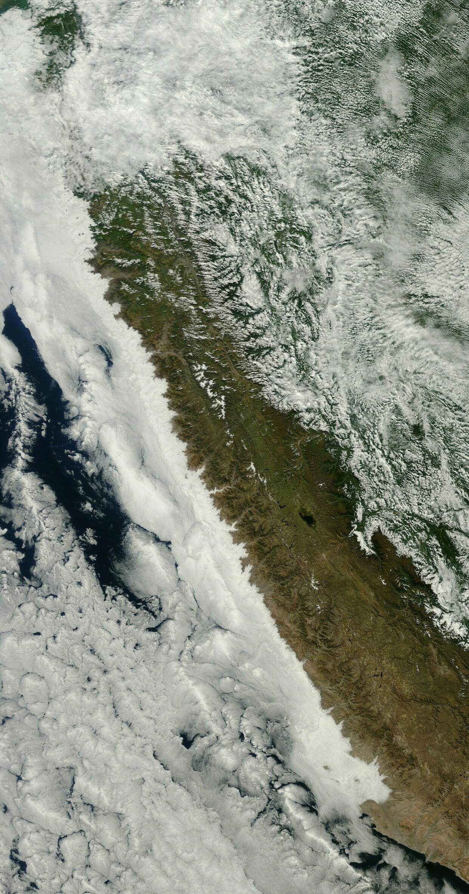

# Cloud-Cover-Detection

## Overview

Satellite imagery is critical for a wide variety of applications from disaster management and recovery, to agriculture, to military intelligence. Clouds present a major obstacle for all of these use cases, and usually have to be identified and removed from a dataset before satellite imagery can be used. **Improving methods of identifying clouds can unlock the potential of an unlimited range of satellite imagery use cases, enabling faster, more efficient, and more accurate image-based research.**

In this challenge, the goal is to detect cloud cover in satellite imagery to remove cloud interference. The challenge uses publicly available satellite data from the [Sentinel-2 mission](https://sentinel.esa.int/web/sentinel/missions/sentinel-2), which captures wide-swath, high-resolution, multi-spectral imaging. For each tile, data is separated into different bands of light across the full visible spectrum, near-infrared, and infrared light. Data is shared through Microsoft's [Planetary Computer](https://planetarycomputer.microsoft.com/). 

This approach secured 36th place out of 847 participants worldwide.

## Approach

The following points briefly explains  the overall approach.

* Raw data is cleaned manually by removing the instances whose label masks are incorrect.

* Each instance in data contains four bands which are used as four input channels to the network.

* Various augmentations like `Flip`, `RandomCrop`, `ShiftScaleRotate`,... are used while training.

* The overall loss function used for training is the weighted sum of `BceLoss`, `DiceLoss`, `JaccardLoss` and `FilteredJaccardLoss`.

* Various networks like `CloudNetp`, `Unet`, `SwinSegmenter`, `SeMask`, `SegNet` and `FPN`  with different backbones and different decode heads were trained and the final submission is the ensemble of those models.

## References

* Competition page - https://www.drivendata.org/competitions/83/cloud-cover/page/396/

* All the run logs can be found here - [Weights & Biases](https://wandb.ai/vstark21/CCD)

* [SeMask: Semantically Masked Transformers for Semantic Segmentation](https://arxiv.org/pdf/2112.12782v1.pdf)

* [Realtime Global Attention Network for Semantic Segmentation](https://arxiv.org/pdf/2112.12939v1.pdf)

* [Cloud and Cloud Shadow Segmentation for Remote
  Sensing Imagery via Filtered Jaccard Loss Function](https://arxiv.org/pdf/2001.08768.pdf)

* [U-Net: Convolutional Networks for Biomedical
  Image Segmentation](https://arxiv.org/pdf/1505.04597.pdf()

* https://github.com/SwinTransformer/Swin-Transformer-Semantic-Segmentation

* https://github.com/Picsart-AI-Research/SeMask-Segmentation

* https://github.com/dveyarangi/cloud-net-plus
